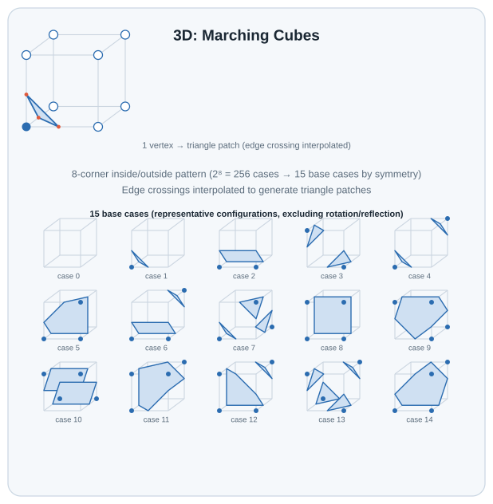
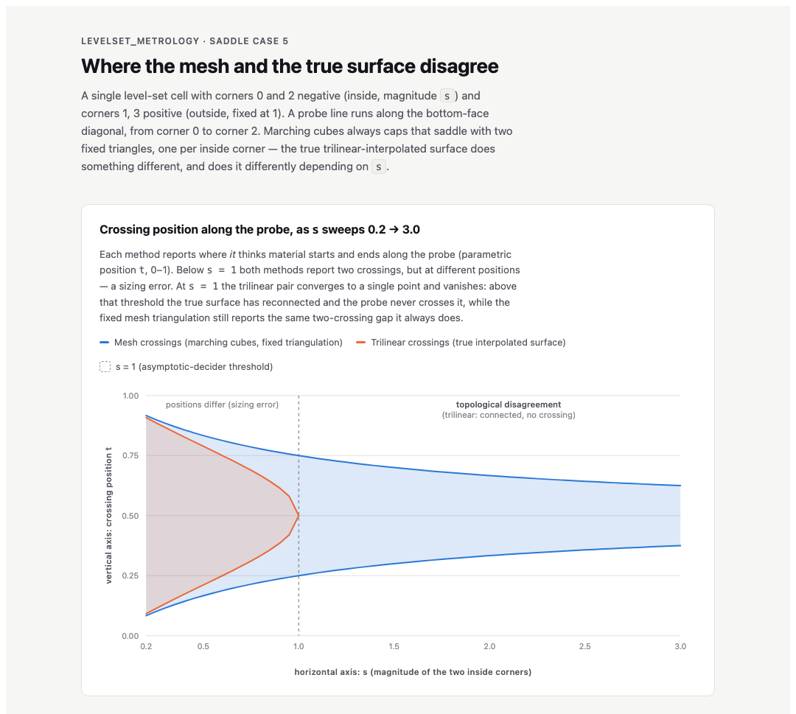
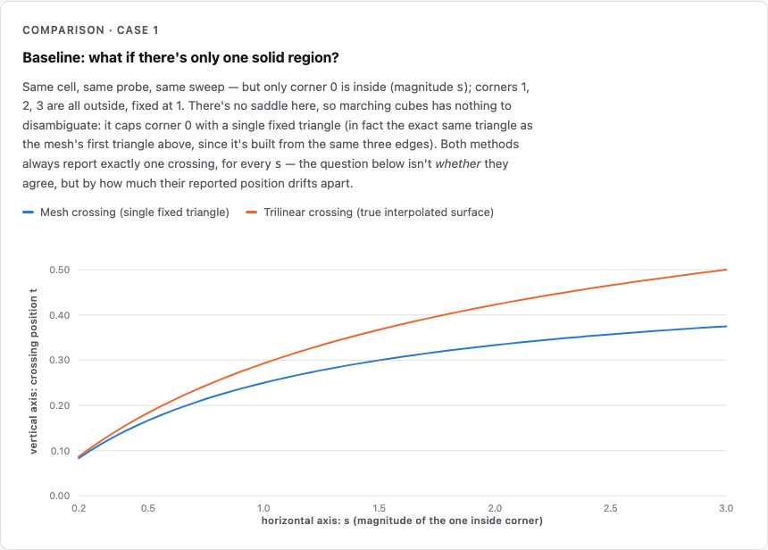
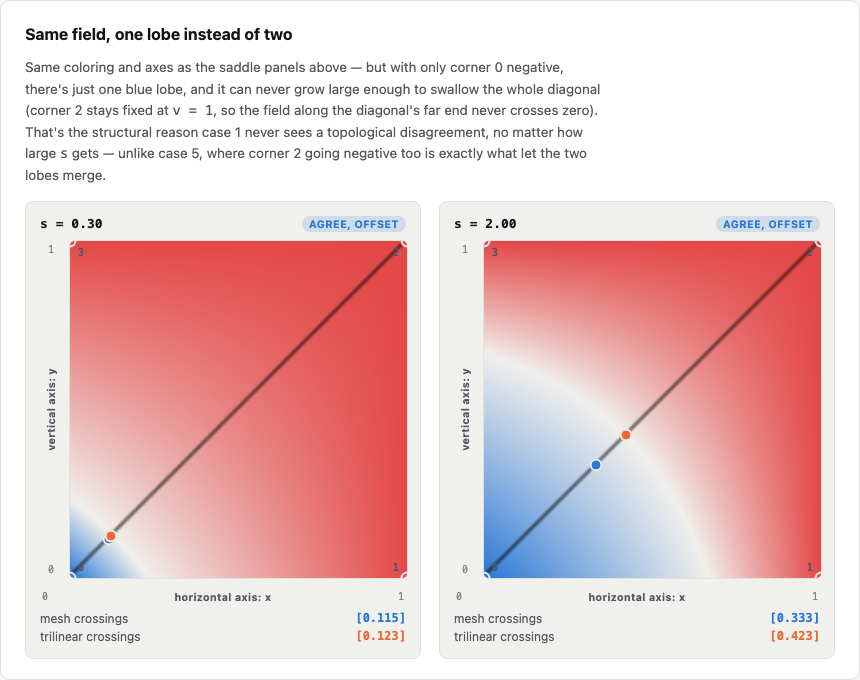
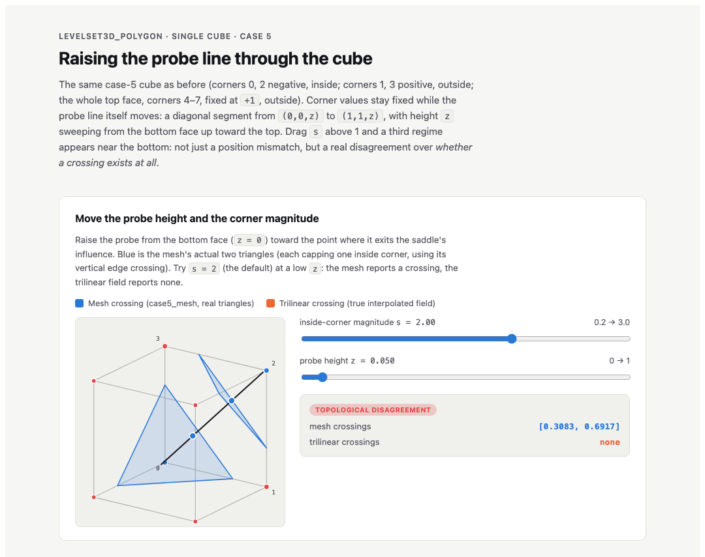
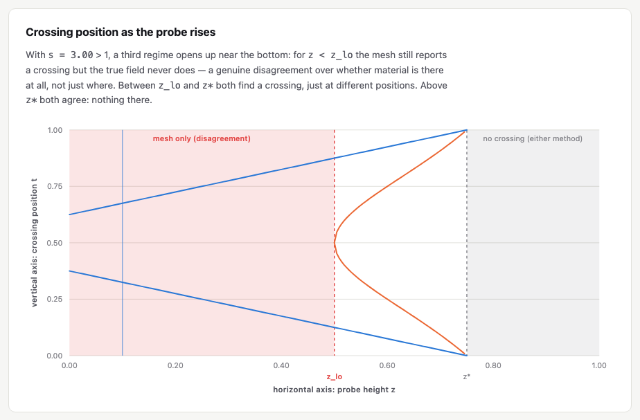

# levelset3d_trilinear_measure

A C++17 header-only library of measurement/comparison primitives for
3D level-set-derived geometry (`ns_cg::Mesh3d`) -- e.g. finding where a
probe line crosses a mesh's boundary, and comparing that against the raw
trilinear interpolant the boundary was extracted from.

Depends only on [`common_geometry`](../common_geometry) -- not on
`levelset3d_polygon` -- and operates purely on already-extracted geometry
(a `Mesh3d`, corner values, etc.) passed in by the caller. It doesn't know
how to run marching cubes or any other extraction algorithm itself; that
stays the extracting project's job.

The 2D counterpart,
[`levelset2d_bilinear_measure`](../levelset2d_bilinear_measure), is a
separate project (not just a namespace split): it operates on
`ns_cg::Edge2d`/`Polygon2d` and bilinear fields instead, and its own
findings differ in kind, not just in dimension -- see that project's
README for why `levelset2d_polygon`'s marching squares never produces the
topological disagreement this project documents below.

## Background: Marching Cubes case topology



These are the 15 base cases (up to rotation/reflection) `levelset3d_polygon`'s
marching cubes table resolves the cube's 256 raw corner-sign combinations
into (`kCubeCornerOffset`/`kTriTable` in `detail/marching_cubes.hpp`).
This diagram's **case 3** -- two face-diagonal vertices inside -- is the
classic ambiguous face saddle: this library's own `case5`/`case10` (named
for their raw 8-bit `case_index`, corners `{0,2}` and `{1,3}` respectively
-- a different numbering than this reduced 15-case diagram's) are both
specific instances of it, and `docs/saddle_crossing_diff.html` (below) is
built entirely around comparing them. The standard table always emits the
same *fixed* triangulation for this case regardless of corner magnitude,
which is exactly what lets it disagree with the raw trilinear field's
true topology. (Case 4, two *body*-diagonal vertices, is a related but
distinct ambiguity this library doesn't cover.)

## Requirements

- CMake >= 3.20
- A C++17 compiler
- [Eigen3](https://eigen.tuxfamily.org/) (e.g. `brew install eigen` on macOS)
- A sibling checkout of [`common_geometry`](../common_geometry) at
  `../common_geometry` relative to this repository

## Building and testing

```sh
cmake -B build -DCMAKE_BUILD_TYPE=Debug
cmake --build build
cd build && ctest --output-on-failure
```

## What's here

- `trilinear.hpp`: `TrilinearValue` (8 corner values -> value at any
  point) and `FindTrilinearCrossings` (every zero-crossing of that
  interpolant along an arbitrary probe line, via dense sampling +
  bisection -- works for any line direction, since the interpolant
  restricted to a line is a cubic in general, not just the linear case
  an axis-aligned probe degenerates to).
- `mesh_intersection.hpp`: `RayTriangleIntersect` (Moller-Trumbore) and
  `FindMeshCrossings` (every crossing of a probe line against an
  `ns_cg::Mesh3d`'s triangles).

Together these are what `levelset3d_polygon`'s
`analysis/saddle_intersection_analysis.cpp` uses to compare "where does
a marching-cubes mesh say the boundary is" against "where does the raw
trilinear interpolant actually cross zero" -- see that project's README
for the actual findings (a real, quantified topology disagreement at the
classic face-saddle ambiguity).

[`docs/saddle_crossing_diff.html`](docs/saddle_crossing_diff.html)
visualizes that disagreement: crossing position vs. the inside-corner
magnitude `s` across the full sweep, plus two field heatmaps (`s =
0.30`, agreeing but offset; `s = 2.00`, disagreeing) showing why -- the
two negative lobes at the saddle's inside corners merge into one
connected region above the threshold, so the probe stops crossing zero
even though the fixed mesh triangulation still reports a gap.



*Static snapshot -- the full sweep over `s = 0.2` to `3.0` is already baked into this one chart. Want to explore it interactively (hover for exact values at any `s`)?* [**Open it live**](https://k-naeba.github.io/levelset3d_trilinear_measure/saddle_crossing_diff.html).

The same page also answers the natural follow-up: how much of that
disagreement is specific to the saddle's *two* separate inside corners?
Corner 0 alone inside (`known_cases.case1_mesh`) is the unambiguous
baseline -- marching cubes has nothing to disambiguate, so mesh and
trilinear always agree on *whether* there's a crossing. The gap between
them is a pure positional offset that grows smoothly with `s`, never a
disagreement in kind:



And the same field-heatmap view as above, now with just one blue lobe
that can never grow large enough to swallow the whole probe diagonal --
which is exactly why case 1 never sees the topological disagreement case
5 does:



[**Open it live**](https://k-naeba.github.io/levelset3d_trilinear_measure/saddle_crossing_diff.html#case1-comparison) (jumps straight to this comparison).

A companion page,
[`docs/mesh_vs_trilinear_probe_height.html`](docs/mesh_vs_trilinear_probe_height.html),
sweeps a different variable: corner values fixed, and the diagonal probe
line itself raised from the bottom face toward the top. Drag the height
slider to move the probe through an interactive 3D projection of the
actual `case5_mesh` triangles, and watch the sweep chart below it -- both
methods' crossings drift apart, then vanish together at the exact height
where the probe exits through the shared corner vertex. A second slider
exposes the inside-corner magnitude `s` itself: past `s = 1` a third
region opens up near the bottom face where the mesh reports a crossing
and the trilinear field reports none at all -- a genuine topological
disagreement, not just a positional one, with its own derived threshold
`z_lo = (s-1)/(1+s)`.



*Shown at `s = 2.00`, `z = 0.05` -- the headline "topological disagreement" state. Want to drag the probe and the corner magnitude yourself?* [**Open it live**](https://k-naeba.github.io/levelset3d_trilinear_measure/mesh_vs_trilinear_probe_height.html).

The "crossing position as the probe rises" chart from that same page, by itself, at the
`s` that makes the two methods disagree the most: `s = 3.00` (the top of the slider's range),
where the mesh-only disagreement band `[0, z_lo]` is at its widest.



Looking for the 2D analog of this same story -- comparing
`levelset2d_polygon`'s extracted-polygon edge crossings against the raw
bilinear field's zero crossings, within a single grid cell? That page
(`polygon_vs_bilinear_probe.html`) now lives in
[`levelset2d_bilinear_measure`](../levelset2d_bilinear_measure), backed by
that project's own `bilinear.hpp`/`polygon_intersection.hpp`.

Both pages here are self-contained (no build step, no server) and served
directly from this repo's `docs/` folder via
[GitHub Pages](https://k-naeba.github.io/levelset3d_trilinear_measure/); they also
still work if you just open the file locally in a browser (or download it
straight from this repo).

## Python bindings

A [pybind11](https://github.com/pybind/pybind11) module (`_levelset3d_trilinear_measure`,
re-exported as `levelset3d_trilinear_measure`) exposes this library's C++ API to
Python for interactive analysis in Jupyter, built via
[scikit-build-core](https://github.com/scikit-build/scikit-build-core).

Scoped exactly like the C++ library itself: `common_geometry` types
(`Mesh3d`) and this project's own functions
(`trilinear_value`, `find_trilinear_crossings`, `ray_triangle_intersect`,
`find_mesh_crossings`) only -- no extraction algorithm (no marching
cubes, no marching squares) is bound or depended on here. A small
pure-Python helper module, `known_cases`, fills the resulting gap for
demos: it hand-reconstructs the two classic marching-cubes face-saddle
triangulations (case 5 / case 10) directly from the corner-value
interpolation formula, without calling any extraction library. This is
verified (see `python/tests/test_bindings.py`) to reproduce, to within
floating-point tolerance, the exact crossing values that
`levelset3d_polygon`'s real marching-cubes implementation produces for
the same corner values.

### Install

```sh
uv venv --python 3.12 .venv
uv pip install --python .venv/bin/python -e ".[notebook]"
```

(Any Python >= 3.10 works; `uv venv --python 3.12` is just a known-good
pin for the notebook/Plotly/NumPy wheel stack at time of writing.)

### Usage

```python
import numpy as np
import levelset3d_trilinear_measure as lm

v = [-1.0, 1.0, 1.0, -1.0, -1.0, 1.0, 1.0, -1.0]
lm.find_trilinear_crossings(v, np.array([0.0, 0.3, 0.7]), np.array([1.0, 0.0, 0.0]))
# -> [0.5]
```

### Notebook

[`python/notebooks/exploration.ipynb`](python/notebooks/exploration.ipynb)
walks through the primitives above and reproduces
`levelset3d_polygon/analysis/saddle_intersection_analysis.cpp`'s case
5/10 sweep interactively (slider-driven, via `ipywidgets`), using
`known_cases.case5_mesh`/`case10_mesh` in place of a real marching-cubes
call. Launch with:

```sh
jupyter lab python/notebooks/
```

This Python layer used to live in a separate `levelset_python` repo
(alongside bindings for the other 4 projects); it was folded in here so
the metrology-specific Python surface has one home, decoupled from any
extraction algorithm's binding lifecycle.
